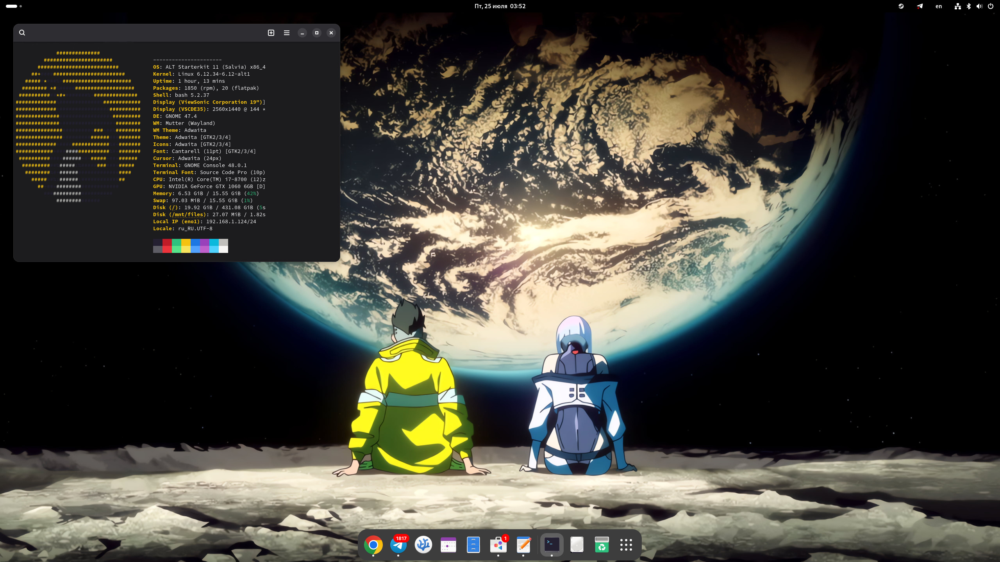

# Время пришло

<figure><figcaption></figcaption></figure>

## Какой ALT Linux выберешь?

### 🔒 Стабильная платформа (p8, p9, p10, p11 и т.д.)

Это основная линия дистрибутивов, предназначенная для корпоративного и массового использования.\
Буква "p" означает "платформа"\
Платформа отличается стабильностью, длительной поддержкой LTS и предсказуемостью.

### 🧩 StarterKit

Это "болванки" на базе стабильной платформы, предназначенные для опытных пользователей и энтузиастов.\
Позволяют собрать свою систему с нужным окружением и пакетом программ.

### 🚀 Regular

"Регулярки" — это дистрибутивы, основанные на актуальных пакетах из репозитория Сизиф (rolling release-подход).\
Они предназначены для тех, кто хочет быть на передовой разработки.


В среде разработки ALT Linux они считаются нестабильными!


### Какую версию ALT Linux использует автор CyberOwl?

Я использую StarterKit P11 GNOME для работы и игр, а для разработки и в качестве тестового полигона — ALT Regular с рабочим столом GNOME.

### Где скачать ALT Linux?


**Важно для юридических лиц:**\
Для легального использования ALT Linux в организациях требуется заключение договора


### Страница загрузки



#### Стартовые наборы



#### Sisyphus


